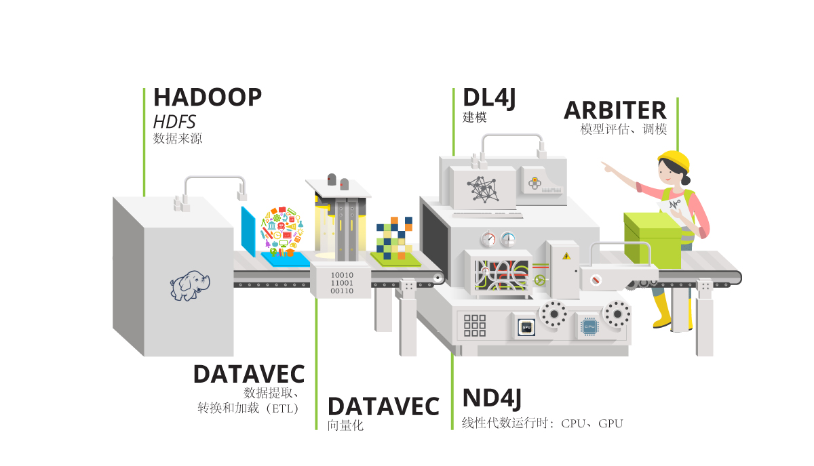

# 第十八章_后端架构选型、离线及实时计算

    Markdown Revision 1;
    Date: 2018/11/11
    Editor: 梁志成
    Contact: superzhicheng@foxmail.com

## 18.1 为什么需要分布式计算？

&emsp;&emsp;在这个数据爆炸的时代，产生的数据量不断地在攀升，从GB,TB,PB,ZB.挖掘其中数据的价值也是企业在不断地追求的终极目标。但是要想对海量的数据进行挖掘，首先要考虑的就是海量数据的存储问题，比如Tb量级的数据。

&emsp;&emsp;谈到数据的存储，则不得不说的是磁盘的数据读写速度问题。早在上个世纪90年代初期，普通硬盘的可以存储的容量大概是1G左右，硬盘的读取速度大概为4.4MB/s.读取一张硬盘大概需要5分钟时间，但是如今硬盘的容量都在1TB左右了,相比扩展了近千倍。但是硬盘的读取速度大概是100MB/s。读完一个硬盘所需要的时间大概是2.5个小时。所以如果是基于TB级别的数据进行分析的话，光硬盘读取完数据都要好几天了，更谈不上计算分析了。那么该如何处理大数据的存储，计算分析呢？

&emsp;&emsp;一个很简单的减少数据读写时间的方法就是同时从多个硬盘上读写数据，比如，如果我们有100个硬盘，每个硬盘存储1%的数据 ，并行读取，那么不到两分钟就可以完成之前需要2.5小时的数据读写任务了。这就是大数据中的分布式存储的模型。当然实现分布式存储还需要解决很多问题，比如硬件故障的问题，使用多台主机进行分布式存储时，若主机故障，会出现数据丢失的问题，所以有了副本机制：系统中保存数据的副本。一旦有系统发生故障，就可以使用另外的副本进行替换（著名的RAID冗余磁盘阵列就是按这个原理实现的）。其次比如一个很大的文件如何进行拆分存储，读取拆分以后的文件如何进行校验都是要考虑的问题。比如我们使用Hadoop中的HDFS也面临这个问题，只是框架给我们实现了这些问题的解决办法，开发中开发者不用考虑这些问题，底层框架已经实现了封装。

&emsp;&emsp;同样假如有一个10TB的文件，我们要统计其中某个关键字的出现次数，传统的做法是遍历整个文件，然后统计出关键字的出现次数，这样效率会特别特别低。基于分布式存储以后，数据被分布式存储在不同的服务器上，那么我们就可以使用分布式计算框架（比如MapReduce,Spark等）来进行并行计算（或者说是分布式计算），即：每个服务器上分别统计自己存储的数据中关键字出现的次数，最后进行一次汇总，那么假如数据分布在100台服务器上，即同时100台服务器同时进行关键字统计工作，效率一下子可以提高几十倍。

## 18.2 目前有哪些深度学习分布式计算框架？

### 18.2.1 PaddlePaddle

&emsp;&emsp;PaddlePaddle【1】是百度开源的一个深度学习平台。PaddlePaddle为深度学习研究人员提供了丰富的API，可以轻松地完成神经网络配置，模型训练等任务。 
官方文档中简易介绍了如何使用框架在
- 线性回归
- 识别数字
- 图像分类
- 词向量
- 个性化推荐
- 情感分析
- 语义角色标注
- 机器翻译

等方面的应用

&emsp;&emsp;Github地址：https://github.com/PaddlePaddle/Paddle

### 18.2.2 Deeplearning4j

&emsp;&emsp;DeepLearning4J（DL4J）【2】是一套基于Java语言的神经网络工具包，可以构建、定型和部署神经网络。DL4J与Hadoop和Spark集成，支持分布式CPU和GPU。

&emsp;&emsp;Deeplearning4j包括了分布式、多线程的深度学习框架，以及普通的单线程深度学习框架。定型过程以集群进行，也就是说，Deeplearning4j可以快速处理大量数据。Deeplearning4j在开放堆栈中作为模块组件的功能，使之成为为微服务架构打造的深度学习框架。

&emsp;&emsp;Deeplearning4j从各类浅层网络出发，设计深层神经网络。这一灵活性使用户可以根据所需，在分布式、生产级、能够在分布式CPU或GPU的基础上与Spark和Hadoop协同工作的框架内，整合受限玻尔兹曼机、其他自动编码器、卷积网络或递归网络。

&emsp;&emsp;Deeplearning4j在已建立的各个库及其在系统整体中的所处位置

&emsp;&emsp;Github地址：https://github.com/deeplearning4j/deeplearning4j

### 18.2.3 Mahout

&emsp;&emsp;Mahout 是基于Hadoop的机器学习和数据挖掘的一个分布式框架。Mahout用MapReduce实现了部分数据挖掘算法，解决了并行挖掘的问题。

&emsp;&emsp;Mahout包含许多实现，包括聚类、分类、推荐过滤、频繁子项挖掘等。

&emsp;&emsp;Mahout算法库：

&emsp;&emsp;Mahout应用场景：

&emsp;&emsp;Github地址：https://github.com/apache/mahout

### 18.2.4 Spark MLllib 

### 18.2.5 Ray

### 18.2.6 Spark stream

### 18.2.7 Horovod

### 18.2.8 BigDL

### 18.2.9 Petastorm

### 18.2.10 TensorFlowOnSpark

## 18.3 如何选择合适的分布式计算框架进行模型训练？

## 18.4 如何进行实时计算？

## 18.5 如何进行离线计算？
   
## 18.6 如何使用分布式框架提高模型训练速度？

## 18.7 深度学习分布式计算框架如何在移动互联网中应用？

## 18.8 如何在个性化推荐中应用深度学习分布式框架？

## 18.9 如何评价个性化推荐系统的效果？

## 18.10 参考文献

【1】http://www.paddlepaddle.org/documentation/book/zh/0.11.0/05.recommender_system/index.cn.html

【2】 http://engineering.skymind.io/distributed-deep-learning-part-1-an-introduction-to-distributed-training-of-neural-networks
 
 ....
 
 未完待续！

