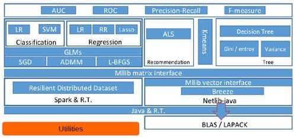
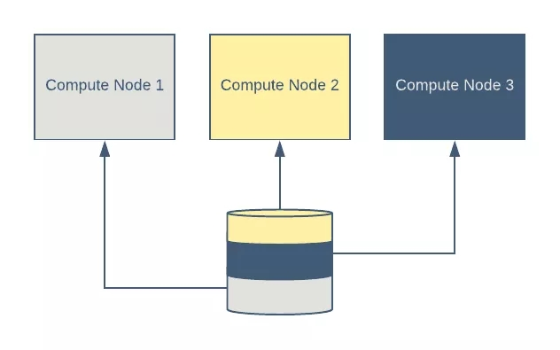
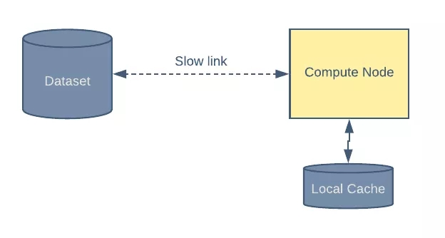
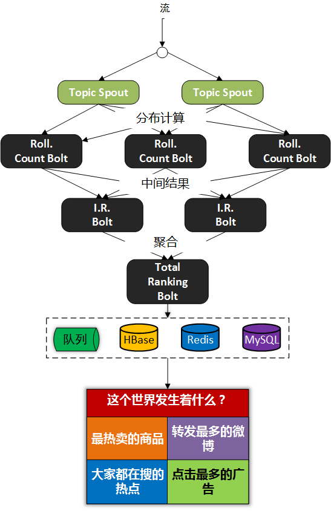
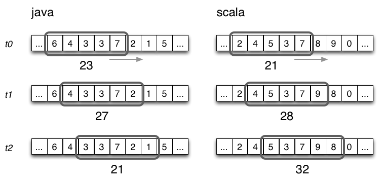
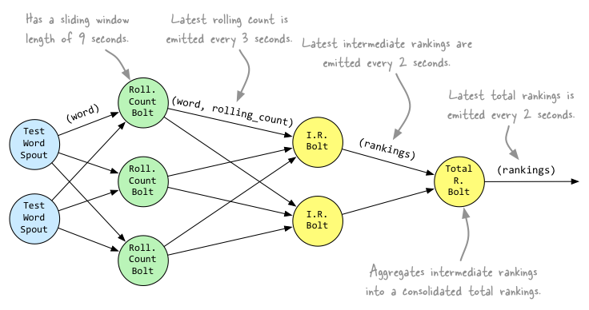
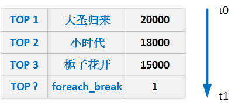

# 第十八章_后端架构选型、离线及实时计算

    Markdown Revision 1;
    Date: 2018/11/11
    Editor: 梁志成
    Contact: superzhicheng@foxmail.com

## 18.1 为什么需要分布式计算？

&emsp;&emsp;在这个数据爆炸的时代，产生的数据量不断地在攀升，从GB,TB,PB,ZB.挖掘其中数据的价值也是企业在不断地追求的终极目标。但是要想对海量的数据进行挖掘，首先要考虑的就是海量数据的存储问题，比如Tb量级的数据。

&emsp;&emsp;谈到数据的存储，则不得不说的是磁盘的数据读写速度问题。早在上个世纪90年代初期，普通硬盘的可以存储的容量大概是1G左右，硬盘的读取速度大概为4.4MB/s.读取一张硬盘大概需要5分钟时间，但是如今硬盘的容量都在1TB左右了,相比扩展了近千倍。但是硬盘的读取速度大概是100MB/s。读完一个硬盘所需要的时间大概是2.5个小时。所以如果是基于TB级别的数据进行分析的话，光硬盘读取完数据都要好几天了，更谈不上计算分析了。那么该如何处理大数据的存储，计算分析呢？

&emsp;&emsp;一个很简单的减少数据读写时间的方法就是同时从多个硬盘上读写数据，比如，如果我们有100个硬盘，每个硬盘存储1%的数据 ，并行读取，那么不到两分钟就可以完成之前需要2.5小时的数据读写任务了。这就是大数据中的分布式存储的模型。当然实现分布式存储还需要解决很多问题，比如硬件故障的问题，使用多台主机进行分布式存储时，若主机故障，会出现数据丢失的问题，所以有了副本机制：系统中保存数据的副本。一旦有系统发生故障，就可以使用另外的副本进行替换（著名的RAID冗余磁盘阵列就是按这个原理实现的）。其次比如一个很大的文件如何进行拆分存储，读取拆分以后的文件如何进行校验都是要考虑的问题。比如我们使用Hadoop中的HDFS也面临这个问题，只是框架给我们实现了这些问题的解决办法，开发中开发者不用考虑这些问题，底层框架已经实现了封装。

&emsp;&emsp;同样假如有一个10TB的文件，我们要统计其中某个关键字的出现次数，传统的做法是遍历整个文件，然后统计出关键字的出现次数，这样效率会特别特别低。基于分布式存储以后，数据被分布式存储在不同的服务器上，那么我们就可以使用分布式计算框架（比如MapReduce,Spark等）来进行并行计算（或者说是分布式计算），即：每个服务器上分别统计自己存储的数据中关键字出现的次数，最后进行一次汇总，那么假如数据分布在100台服务器上，即同时100台服务器同时进行关键字统计工作，效率一下子可以提高几十倍。

## 18.2 目前有哪些深度学习分布式计算框架？

### 18.2.1 PaddlePaddle

&emsp;&emsp;PaddlePaddle【1】是百度开源的一个深度学习平台。PaddlePaddle为深度学习研究人员提供了丰富的API，可以轻松地完成神经网络配置，模型训练等任务。 
官方文档中简易介绍了如何使用框架在
- 线性回归
- 识别数字
- 图像分类
- 词向量
- 个性化推荐
- 情感分析
- 语义角色标注
- 机器翻译

等方面的应用

&emsp;&emsp;Github地址：https://github.com/PaddlePaddle/Paddle

### 18.2.2 Deeplearning4j

&emsp;&emsp;DeepLearning4J（DL4J）【2】是一套基于Java语言的神经网络工具包，可以构建、定型和部署神经网络。DL4J与Hadoop和Spark集成，支持分布式CPU和GPU。

&emsp;&emsp;Deeplearning4j包括了分布式、多线程的深度学习框架，以及普通的单线程深度学习框架。定型过程以集群进行，也就是说，Deeplearning4j可以快速处理大量数据。Deeplearning4j在开放堆栈中作为模块组件的功能，使之成为为微服务架构打造的深度学习框架。

&emsp;&emsp;Deeplearning4j从各类浅层网络出发，设计深层神经网络。这一灵活性使用户可以根据所需，在分布式、生产级、能够在分布式CPU或GPU的基础上与Spark和Hadoop协同工作的框架内，整合受限玻尔兹曼机、其他自动编码器、卷积网络或递归网络。

&emsp;&emsp;Deeplearning4j在已建立的各个库及其在系统整体中的所处位置


&emsp;&emsp;Github地址：https://github.com/deeplearning4j/deeplearning4j

### 18.2.3 Mahout

&emsp;&emsp;Mahout【3】是基于Hadoop的机器学习和数据挖掘的一个分布式框架。Mahout用MapReduce实现了部分数据挖掘算法，解决了并行挖掘的问题。

&emsp;&emsp;Mahout包含许多实现，包括聚类、分类、推荐过滤、频繁子项挖掘等。

&emsp;&emsp;Mahout算法库：


&emsp;&emsp;Mahout应用场景：


&emsp;&emsp;Github地址：https://github.com/apache/mahout

### 18.2.4 Spark MLllib 

&emsp;&emsp;MLlib(Machine Learnig lib) 【4】是Spark对常用的机器学习算法的实现库，同时包括相关的测试和数据生成器。

&emsp;&emsp;MLlib是MLBase一部分，其中MLBase分为四部分：MLlib、MLI、ML Optimizer和MLRuntime。
- ML Optimizer会选择它认为最适合的已经在内部实现好了的机器学习算法和相关参数，来处理用户输入的数据，并返回模型或别的帮助分析的结果；
- MLI 是一个进行特征抽取和高级ML编程抽象的算法实现的API或平台；
- MLlib是Spark实现一些常见的机器学习算法和实用程序，包括分类、回归、聚类、协同过滤、降维以及底层优化，该算法可以进行可扩充； MLRuntime 基于Spark计算框架，将Spark的分布式计算应用到机器学习领域。

&emsp;&emsp;MLlib主要包含三个部分：
- 底层基础：包括Spark的运行库、矩阵库和向量库
- 算法库：包含广义线性模型、推荐系统、聚类、决策树和评估的算法
- 实用程序：包括测试数据的生成、外部数据的读入等功能


<center>架构图</center>


&emsp;&emsp;MLlib目前支持4种常见的机器学习问题: 分类、回归、聚类和协同过滤，MLlib在Spark整个生态系统中的位置如图下图所示。

### 18.2.5 Ray

&emsp;&emsp;Ray【5】是加州大学伯克利分校实时智能安全执行实验室(RISELab)的研究人员针对机器学习领域开发的一种新的分布式计算框架，该框架旨在让基于Python的机器学习和深度学习工作负载能够实时执行，并具有类似消息传递接口(MPI)的性能和细粒度。

&emsp;&emsp;增强学习的场景，按照原理定义，因为没有预先可用的静态标签信息，所以通常需要引入实际的目标系统（为了加快训练，往往是目标系统的模拟环境）来获取反馈信息，用做损失/收益判断，进而完成整个训练过程的闭环反馈。典型的步骤是通过观察特定目标系统的状态，收集反馈信息，判断收益，用这些信息来调整参数，训练模型，并根据新的训练结果产出可用于调整目标系统的行为Action，输出到目标系统，进而影响目标系统状态变化，完成闭环，如此反复迭代，最终目标是追求某种收益的最大化（比如对AlphoGo来说，收益是赢得一盘围棋的比赛）。

&emsp;&emsp;在这个过程中，一方面，模拟目标系统，收集状态和反馈信息，判断收益，训练参数，生成Action等等行为可能涉及大量的任务和计算（为了选择最佳Action，可能要并发模拟众多可能的行为）。而这些行为本身可能也是千差万别的异构的任务，任务执行的时间也可能长短不一，执行过程有些可能要求同步，也有些可能更适合异步。

&emsp;&emsp;另一方面，整个任务流程的DAG图也可能是动态变化的，系统往往可能需要根据前一个环节的结果，调整下一个环节的行为参数或者流程。这种调整，可能是目标系统的需要（比如在自动驾驶过程中遇到行人了，那么我们可能需要模拟计算刹车的距离来判断该采取的行动是刹车还是拐弯，而平时可能不需要这个环节），也可能是增强学习特定训练算法的需要（比如根据多个并行训练的模型的当前收益，调整模型超参数，替换模型等等）。

&emsp;&emsp;此外，由于所涉及到的目标系统可能是具体的，现实物理世界中的系统，所以对时效性也可能是有强要求的。举个例子，比如你想要实现的系统是用来控制机器人行走，或者是用来打视频游戏的。那么整个闭环反馈流程就需要在特定的时间限制内完成（比如毫秒级别）。

&emsp;&emsp;总结来说，就是增强学习的场景，对分布式计算框架的任务调度延迟，吞吐量和动态修改DAG图的能力都可能有很高的要求。按照官方的设计目标，Ray需要支持异构计算任务，动态计算链路，毫秒级别延迟和每秒调度百万级别任务的能力。

&emsp;&emsp;Ray的目标问题，主要是在类似增强学习这样的场景中所遇到的工程问题。那么增强学习的场景和普通的机器学习，深度学习的场景又有什么不同呢？简单来说，就是对整个处理链路流程的时效性和灵活性有更高的要求。

Ray框架优点
- 海量任务调度能力
- 毫秒级别的延迟
- 异构任务的支持
- 任务拓扑图动态修改的能力

&emsp;&emsp;Ray没有采用中心任务调度的方案，而是采用了类似层级（hierarchy）调度的方案，除了一个全局的中心调度服务节点（实际上这个中心调度节点也是可以水平拓展的），任务的调度也可以在具体的执行任务的工作节点上，由本地调度服务来管理和执行。
与传统的层级调度方案，至上而下分配调度任务的方式不同的是，Ray采用了至下而上的调度策略。也就是说，任务调度的发起，并不是先提交给全局的中心调度器统筹规划以后再分发给次级调度器的。而是由任务执行节点直接提交给本地的调度器，本地的调度器如果能满足该任务的调度需求就直接完成调度请求，在无法满足的情况下，才会提交给全局调度器，由全局调度器协调转发给有能力满足需求的另外一个节点上的本地调度器去调度执行。

&emsp;&emsp;架构设计一方面减少了跨节点的RPC开销，另一方面也能规避中心节点的瓶颈问题。当然缺点也不是没有，由于缺乏全局的任务视图，无法进行全局规划，因此任务的拓扑逻辑结构也就未必是最优的了。


<center>架构图</center>


<center>任务调度图</center>

&emsp;&emsp;Ray架构现状：
- API层以上 的部分还比较薄弱，Core模块核心逻辑估需要时间打磨。
- 国内目前除了蚂蚁金服和RISELab有针对性的合作以外，关注程度还很低，没有实际的应用实例看到，整体来说还处于比较早期的框架构建阶段。

&emsp;&emsp;Github地址：https://github.com/ray-project/ray

### 18.2.6 Spark stream

&emsp;&emsp;随着大数据的发展，人们对大数据的处理要求也越来越高，原有的批处理框架MapReduce适合离线计算，却无法满足实时性要求较高的业务，如实时推荐、用户行为分析等。 Spark Streaming是建立在Spark上的实时计算框架，通过它提供的丰富的API、基于内存的高速执行引擎，用户可以结合流式、批处理和交互试查询应用。

&emsp;&emsp;Spark是一个类似于MapReduce的分布式计算框架，其核心是弹性分布式数据集，提供了比MapReduce更丰富的模型，可以在快速在内存中对数据集进行多次迭代，以支持复杂的数据挖掘算法和图形计算算法。Spark Streaming【6】是一种构建在Spark上的实时计算框架，它扩展了Spark处理大规模流式数据的能力。

&emsp;&emsp;Spark Streaming的优势在于：
- 能运行在100+的结点上，并达到秒级延迟。
- 使用基于内存的Spark作为执行引擎，具有高效和容错的特性。
- 能集成Spark的批处理和交互查询。
- 为实现复杂的算法提供和批处理类似的简单接口。


<center>Spark Streaming架构图</center>

&emsp;&emsp;Spark Streaming把实时输入数据流以时间片Δt （如1秒）为单位切分成块。Spark Streaming会把每块数据作为一个RDD，并使用RDD操作处理每一小块数据。每个块都会生成一个Spark Job处理，最终结果也返回多块。


<center>Spark Streaming基本原理图</center>

&emsp;&emsp;正如Spark Streaming最初的目标一样，它通过丰富的API和基于内存的高速计算引擎让用户可以结合流式处理，批处理和交互查询等应用。因此Spark Streaming适合一些需要历史数据和实时数据结合分析的应用场合。当然，对于实时性要求不是特别高的应用也能完全胜任。另外通过RDD的数据重用机制可以得到更高效的容错处理。

### 18.2.7 Horovod

&emsp;&emsp;Horovod【7】 是 Uber 开源的又一个深度学习工具，它的发展吸取了 Facebook「一小时训练 ImageNet 论文」与百度 Ring Allreduce 的优点，可为用户实现分布式训练提供帮助。

&emsp;&emsp;Horovod 支持通过用于高性能并行计算的低层次接口 – 消息传递接口 (MPI) 进行分布式模型训练。有了 MPI，就可以利用分布式 Kubernetes 集群来训练 TensorFlow 和 PyTorch 模型。

&emsp;&emsp;分布式 TensorFlow 的参数服务器模型（parameter server paradigm）通常需要对大量样板代码进行认真的实现。但是 Horovod 仅需要几行。下面是一个分布式 TensorFlow 项目使用 Horovod 的示例：
```
import  tensorflow as tf
import horovod.tensorflow as hvd
# Initialize Horovod
hvd.init()
# Pin GPU to be used to process local rank (one GPU per process)
config = tf.ConfigProto()
config.gpu_options.visible_device_list = str(hvd.local_rank())
# Build model…
loss = …
opt = tf.train.AdagradOptimizer(0.01)
# Add Horovod Distributed Optimizer
opt = hvd.DistributedOptimizer(opt)
# Add hook to broadcast variables from rank 0 to all other processes during
# initialization.
hooks = [hvd.BroadcastGlobalVariablesHook(0)]
# Make training operation
train_op = opt.minimize(loss)
# The MonitoredTrainingSession takes care of session initialization,
# restoring from a checkpoint, saving to a checkpoint, and closing when done
# or an error occurs.
with tf.train.MonitoredTrainingSession(checkpoint_dir=“/tmp/train_logs”,
                                      config=config,
                                      hooks=hooks) as mon_sess:
 while not mon_sess.should_stop():
   # Perform synchronous training.
   mon_sess.run(train_op)
```

&emsp;&emsp;在该示例中，粗体文字指进行单个 GPU 分布式项目时必须做的改变：

- hvd.init() 初始化 Horovod。
- config.gpu_options.visible_device_list = str(hvd.local_rank()) 向每个 TensorFlow 流程分配一个 GPU。
- opt=hvd.DistributedOptimizer(opt) 使用 Horovod 优化器包裹每一个常规 TensorFlow 优化器，Horovod 优化器使用 ring-allreduce 平均梯度。
- hvd.BroadcastGlobalVariablesHook(0) 将变量从第一个流程向其他流程传播，以实现一致性初始化。如果该项目无法使用 MonitoredTrainingSession，则用户可以运行 hvd.broadcast_global_variables(0)。

&emsp;&emsp;之后，可以使用 mpirun 命令使该项目的多个拷贝在多个服务器中运行：

```
$ mpirun -np 16 -x LD_LIBRARY_PATH -H 
server1:4,server2:4,server3:4,server4:4 python train.py
```

&emsp;&emsp;mpirun 命令向四个节点分布 train.py，然后在每个节点的四个 GPU 上运行 train.py。

&emsp;&emsp;Github地址：https://github.com/uber/horovod

### 18.2.8 BigDL

&emsp;&emsp;BigDL【9】是一种基于Apache Spark的分布式深度学习框架。它可以无缝的直接运行在现有的Apache Spark和Hadoop集群之上。BigDL的设计吸取了Torch框架许多方面的知识，为深度学习提供了全面的支持；包括数值计算和高级神经网络；借助现有的Spark集群来运行深度学习计算，并简化存储在Hadoop中的大数据集的数据加载。

&emsp;&emsp;BigDL优点：
- 丰富的深度学习支持。模拟Torch之后，BigDL为深入学习提供全面支持，包括数字计算（通过Tensor）和高级神经网络 ; 此外，用户可以使用BigDL将预先训练好的Caffe或Torch模型加载到Spark程序中。
- 极高的性能。为了实现高性能，BigDL在每个Spark任务中使用英特尔MKL和多线程编程。因此，在单节点Xeon（即与主流GPU 相当）上，它比开箱即用开源Caffe，Torch或TensorFlow快了数量级。
- 有效地横向扩展。BigDL可以通过利用Apache Spark（快速分布式数据处理框架），以及高效实施同步SGD和全面减少Spark的通信，从而有效地扩展到“大数据规模”上的数据分析

&emsp;&emsp;BigDL缺点：
- 对机器要求高 jdk7上运行性能差 在CentOS 6和7上，要将最大用户进程增加到更大的值（例如514585）; 否则，可能会看到错误，如“无法创建新的本机线程”。 
- 训练和验证的数据会加载到内存，挤占内存

&emsp;&emsp;BigDL满足的应用场景：
- 直接在Hadoop/Spark框架下使用深度学习进行大数据分析（即将数据存储在HDFS、HBase、Hive等数据库上）；
- 在Spark程序中/工作流中加入深度学习功能；
- 利用现有的 Hadoop/Spark 集群来运行深度学习程序，然后将代码与其他的应用场景进行动态共享，例如ETL（Extract、Transform、Load，即通常所说的数据抽取）、数据仓库（data warehouse）、功能引擎、经典机器学习、图表分析等。

### 18.2.9 Petastorm

&emsp;&emsp;Petastorm是一个由 Uber ATG 开发的开源数据访问库。这个库可以直接基于数 TB Parquet 格式的数据集进行单机或分布式训练和深度学习模型评估。Petastorm 支持基于 Python 的机器学习框架，如 Tensorflow、Pytorch 和 PySpark，也可以直接用在 Python 代码中。


<center>深度学习集群</center>

&emsp;&emsp;即使是在现代硬件上训练深度模型也很耗时，而且在很多情况下，很有必要在多台机器上分配训练负载。典型的深度学习集群需要执行以下几个步骤：
- 一台或多台机器读取集中式或本地数据集。
- 每台机器计算损失函数的值，并根据模型参数计算梯度。在这一步通常会使用 GPU。
- 通过组合估计的梯度（通常由多台机器以分布式的方式计算得出）来更新模型系数。

&emsp;&emsp;通常，一个数据集是通过连接多个数据源的记录而生成的。这个由 Apache Spark 的 Python 接口 PySpark 生成的数据集稍后将被用在机器学习训练中。Petastorm 提供了一个简单的功能，使用 Petastorm 特定的元数据对标准的 Parquet 进行了扩展，从而让它可以与 Petastorm 兼容。
有了 Petastorm，消费数据就像在 HDFS 或文件系统中创建和迭代读取对象一样简单。Petastorm 使用 PyArrow 来读取 Parquet 文件。

&emsp;&emsp;将多个数据源组合到单个表格结构中，从而生成数据集。可以多次使用相同的数据集进行模型训练和评估。

<center>深度学习集群</center>

&emsp;&emsp;为分布式训练进行分片
在分布式训练环境中，每个进程通常负责训练数据的一个子集。一个进程的数据子集与其他进程的数据子集正交。Petastorm 支持将数据集的读时分片转换为正交的样本集。

<center>Petastorm 将数据集的非重叠子集提供给参与分布式训练的不同机器</center>

&emsp;&emsp;本地缓存
Petastorm 支持在本地存储中缓存数据。当网络连接速度较慢或带宽很昂贵时，这会派上用场。


Github地址：https://github.com/uber/petastorm

### 18.2.10 TensorFlowOnSpark

&emsp;&emsp;TensorFlowOnSpark【10】为 Apache Hadoop 和 Apache Spark 集群带来可扩展的深度学习。 通过结合深入学习框架 TensorFlow 和大数据框架 Apache Spark 、Apache Hadoop 的显着特征，TensorFlowOnSpark 能够在 GPU 和 CPU 服务器集群上实现分布式深度学习。

&emsp;&emsp;满足的应用场景：
为了利用TensorFlow在现有的Spark和Hadoop集群上进行深度学习。而不需要为深度学习设置单独的集群。


<center>架构图</center>


<center>运行流程图</center>

&emsp;&emsp;优点：
- 轻松迁移所有现有的TensorFlow程序，<10行代码更改; 
- 支持所有TensorFlow功能：同步/异步训练，模型/数据并行，推理和TensorBoard; 
- 服务器到服务器的直接通信在可用时实现更快的学习; 
- 允许数据集在HDFS和由Spark推动的其他来源或由TensorFlow拖动; 
- 轻松集成您现有的数据处理流水线和机器学习算法（例如，MLlib，CaffeOnSpark）; 
- 轻松部署在云或内部部署：CPU和GPU，以太网和Infiniband。
- TensorFlowOnSpark是基于google的TensorFlow的实现，而TensorFlow有着一套完善的教程，内容丰富。 

&emsp;&emsp;劣势：
- 开源时间不长，未得到充分的验证。

&emsp;&emsp;Github 地址:https://github.com/yahoo/TensorFlowOnSpark

## 18.3 如何选择合适的分布式计算框架进行模型训练？

## 18.4 如何进行实时计算？

### 18.4.1 什么是实时流计算？

&emsp;&emsp;所谓实时流计算，就是近几年由于数据得到广泛应用之后，在数据持久性建模不满足现状的情况下，急需数据流的瞬时建模或者计算处理。这种实时计算的应用实例有金融服务、网络监控、电信数据管理、 Web 应用、生产制造、传感检测，等等。在这种数据流模型中，单独的数据单元可能是相关的元组（Tuple），如网络测量、呼叫记录、网页访问等产生的数据。但是，这些数据以大量、快速、时变（可能是不可预知）的数据流持续到达，由此产生了一些基础性的新的研究问题——实时计算。实时计算的一个重要方向就是实时流计算。

### 18.4.2 实时流计算过程



&emsp;&emsp;我们以热卖产品的统计为例，看下传统的计算手段：
- 将用户行为、log等信息清洗后保存在数据库中.
- 将订单信息保存在数据库中.
- 利用触发器或者协程等方式建立本地索引，或者远程的独立索引.
- join订单信息、订单明细、用户信息、商品信息等等表，聚合统计20分钟内热卖产品，并返回top-10.
- web或app展示.

&emsp;&emsp;这是一个假想的场景，但假设你具有处理类似场景的经验，应该会体会到这样一些问题和难处：
- 水平扩展问题（scale-out）
显然，如果是一个具有一定规模的电子商务网站，数据量都是很大的。而交易信息因为涉及事务，所以很难直接舍弃关系型数据库的事务能力，迁移到具有更好的scale-out能力的NoSQL数据库中。

&emsp;&emsp;那么，一般都会做sharding。历史数据还好说，我们可以按日期来归档，并可以通过批处理式的离线计算，将结果缓存起来。
但是，这里的要求是20分钟内，这很难。
- 性能问题
这个问题，和scale-out是一致的，假设我们做了sharding，因为表分散在各个节点中，所以我们需要多次入库，并在业务层做聚合计算。

&emsp;&emsp;问题是，20分钟的时间要求，我们需要入库多少次呢？
10分钟呢？
5分钟呢？
实时呢？

&emsp;&emsp;而且，业务层也同样面临着单点计算能力的局限，需要水平扩展，那么还需要考虑一致性的问题。
所以，到这里一切都显得很复杂。
- 业务扩展问题

&emsp;&emsp;假设我们不仅仅要处理热卖商品的统计，还要统计广告点击、或者迅速根据用户的访问行为判断用户特征以调整其所见的信息，更加符合用户的潜在需求等，那么业务层将会更加复杂。
也许你有更好的办法，但实际上，我们需要的是一种新的认知：
这个世界发生的事，是实时的。
所以我们需要一种实时计算的模型，而不是批处理模型。
我们需要的这种模型，必须能够处理很大的数据，所以要有很好的scale-out能力，最好是，我们都不需要考虑太多一致性、复制的问题。

&emsp;&emsp;那么，这种计算模型就是实时计算模型，也可以认为是流式计算模型。
现在假设我们有了这样的模型，我们就可以愉快地设计新的业务场景：
- 转发最多的微博是什么？
- 最热卖的商品有哪些？
- 大家都在搜索的热点是什么？
- 我们哪个广告，在哪个位置，被点击最多？
或者说，我们可以问：
&emsp;&emsp;这个世界，在发生什么？

&emsp;&emsp;最热的微博话题是什么？
我们以一个简单的滑动窗口计数的问题，来揭开所谓实时计算的神秘面纱。
假设，我们的业务要求是：
统计20分钟内最热的10个微博话题。

&emsp;&emsp;解决这个问题，我们需要考虑：
- 数据源

&emsp;&emsp;这里，假设我们的数据，来自微博长连接推送的话题。
- 问题建模

&emsp;&emsp;我们认为的话题是#号扩起来的话题，最热的话题是此话题出现的次数比其它话题都要多。
比如：@foreach_break : 你好,#世界#,我爱你，#微博#。
“世界”和“微博”就是话题。
- 计算引擎

&emsp;&emsp;我们采用storm。
- 定义时间
如何定义时间？

&emsp;&emsp;时间的定义是一件很难的事情，取决于所需的精度是多少。
根据实际，我们一般采用tick来表示时刻这一概念。
在storm的基础设施中，executor启动阶段，采用了定时器来触发“过了一段时间”这个事件。
如下所示：
```
(defn setup-ticks! [worker executor-data]
  (let [storm-conf (:storm-conf executor-data)
        tick-time-secs (storm-conf TOPOLOGY-TICK-TUPLE-FREQ-SECS)
        receive-queue (:receive-queue executor-data)
        context (:worker-context executor-data)]
    (when tick-time-secs
      (if (or (system-id? (:component-id executor-data))
              (and (= false (storm-conf TOPOLOGY-ENABLE-MESSAGE-TIMEOUTS))
                   (= :spout (:type executor-data))))
        (log-message "Timeouts disabled for executor " (:component-id executor-data) ":" (:executor-id executor-data))
        (schedule-recurring
          (:user-timer worker)
          tick-time-secs
          tick-time-secs
          (fn []
            (disruptor/publish
              receive-queue
              [[nil (TupleImpl. context [tick-time-secs] Constants/SYSTEM_TASK_ID Constants/SYSTEM_TICK_STREAM_ID)]]
              )))))))
```
之前的博文中，已经详细分析了这些基础设施的关系，不理解的童鞋可以翻看前面的文章。
每隔一段时间，就会触发这样一个事件，当流的下游的bolt收到一个这样的事件时，就可以选择是增量计数还是将结果聚合并发送到流中。
bolt如何判断收到的tuple表示的是“tick”呢？
负责管理bolt的executor线程，从其订阅的消息队列消费消息时，会调用到bolt的execute方法，那么，可以在execute中这样判断：
```
public static boolean isTick(Tuple tuple) {
    return tuple != null
           && Constants.SYSTEM_COMPONENT_ID  .equals(tuple.getSourceComponent())
           && Constants.SYSTEM_TICK_STREAM_ID.equals(tuple.getSourceStreamId());
}
```
结合上面的setup-tick!的clojure代码，我们可以知道SYSTEM_TICK_STREAM_ID在定时事件的回调中就以构造函数的参数传递给了tuple，那么SYSTEM_COMPONENT_ID是如何来的呢？
可以看到，下面的代码中，SYSTEM_TASK_ID同样传给了tuple：
;; 请注意SYSTEM_TASK_ID和SYSTEM_TICK_STREAM_ID
(TupleImpl. context [tick-time-secs] Constants/SYSTEM_TASK_ID Constants/SYSTEM_TICK_STREAM_ID)
然后利用下面的代码，就可以得到SYSTEM_COMPONENT_ID：
```
    public String getComponentId(int taskId) {
        if(taskId==Constants.SYSTEM_TASK_ID) {
            return Constants.SYSTEM_COMPONENT_ID;
        } else {
            return _taskToComponent.get(taskId);
        }
    }
```
滑动窗口
有了上面的基础设施，我们还需要一些手段来完成“工程化”，将设想变为现实。
这里，我们看看Michael G. Noll的滑动窗口设计。



Topology

```
    String spoutId = "wordGenerator";
    String counterId = "counter";
    String intermediateRankerId = "intermediateRanker";
    String totalRankerId = "finalRanker";
    // 这里，假设TestWordSpout就是我们发送话题tuple的源
    builder.setSpout(spoutId, new TestWordSpout(), 5);
    // RollingCountBolt的时间窗口为9秒钟，每3秒发送一次统计结果到下游
    builder.setBolt(counterId, new RollingCountBolt(9, 3), 4).fieldsGrouping(spoutId, new Fields("word"));
    // IntermediateRankingsBolt，将完成部分聚合，统计出top-n的话题
    builder.setBolt(intermediateRankerId, new IntermediateRankingsBolt(TOP_N), 4).fieldsGrouping(counterId, new Fields(
        "obj"));
        // TotalRankingsBolt， 将完成完整聚合，统计出top-n的话题
    builder.setBolt(totalRankerId, new TotalRankingsBolt(TOP_N)).globalGrouping(intermediateRankerId);
 ```

上面的topology设计如下：



将聚合计算与时间结合起来
前文，我们叙述了tick事件，回调中会触发bolt的execute方法，那可以这么做：

```
RollingCountBolt:
  @Override
  public void execute(Tuple tuple) {
    if (TupleUtils.isTick(tuple)) {
      LOG.debug("Received tick tuple, triggering emit of current window counts");
      // tick来了，将时间窗口内的统计结果发送，并让窗口滚动
      emitCurrentWindowCounts();
    }
    else {
      // 常规tuple，对话题计数即可
      countObjAndAck(tuple);
    }
  }

  // obj即为话题，增加一个计数 count++
  // 注意，这里的速度基本取决于流的速度，可能每秒百万，也可能每秒几十.
  // 内存不足？ bolt可以scale-out.
  private void countObjAndAck(Tuple tuple) {
    Object obj = tuple.getValue(0);
    counter.incrementCount(obj);
    collector.ack(tuple);
  }
  
  // 将统计结果发送到下游
  private void emitCurrentWindowCounts() {
    Map<Object, Long> counts = counter.getCountsThenAdvanceWindow();
    int actualWindowLengthInSeconds = lastModifiedTracker.secondsSinceOldestModification();
    lastModifiedTracker.markAsModified();
    if (actualWindowLengthInSeconds != windowLengthInSeconds) {
      LOG.warn(String.format(WINDOW_LENGTH_WARNING_TEMPLATE, actualWindowLengthInSeconds, windowLengthInSeconds));
    }
    emit(counts, actualWindowLengthInSeconds);
  }
 ```

上面的代码可能有点抽象，看下这个图就明白了，tick一到，窗口就滚动：


```
IntermediateRankingsBolt & TotalRankingsBolt：
  public final void execute(Tuple tuple, BasicOutputCollector collector) {
    if (TupleUtils.isTick(tuple)) {
      getLogger().debug("Received tick tuple, triggering emit of current rankings");
      // 将聚合并排序的结果发送到下游
      emitRankings(collector);
    }
    else {
      // 聚合并排序
      updateRankingsWithTuple(tuple);
    }
  }
```
&emsp;&emsp;其中，IntermediateRankingsBolt和TotalRankingsBolt的聚合排序方法略有不同：

IntermediateRankingsBolt的聚合排序方法：

```
  @Override
  void updateRankingsWithTuple(Tuple tuple) {
    // 这一步，将话题、话题出现的次数提取出来
    Rankable rankable = RankableObjectWithFields.from(tuple);
    // 这一步，将话题出现的次数进行聚合，然后重排序所有话题
    super.getRankings().updateWith(rankable);
  }
```

TotalRankingsBolt的聚合排序方法：

```
  @Override
  void updateRankingsWithTuple(Tuple tuple) {
  // 提出来自IntermediateRankingsBolt的中间结果
    Rankings rankingsToBeMerged = (Rankings) tuple.getValue(0);
  // 聚合并排序
    super.getRankings().updateWith(rankingsToBeMerged);
  // 去0，节约内存
    super.getRankings().pruneZeroCounts();
  }
```

而重排序方法比较简单粗暴，因为只求前N个，N不会很大：

```
  private void rerank() {
    Collections.sort(rankedItems);
    Collections.reverse(rankedItems);
  }
```  

&emsp;&emsp;结语

&emsp;&emsp;下图可能就是我们想要的结果，我们完成了t0 - t1时刻之间的热点话题统计. 


## 18.5 如何进行离线计算？
   
## 18.6 如何使用分布式框架提高模型训练速度？

## 18.7 深度学习分布式计算框架如何在移动互联网中应用？

## 18.8 如何在个性化推荐中应用深度学习分布式框架？

## 18.9 如何评价个性化推荐系统的效果？

### 18.9.1 准确率与召回率（Precision & Recall）

&emsp;&emsp;准确率和召回率是广泛用于信息检索和统计学分类领域的两个度量值，用来评价结果的质量。其中精度是检索出相关文档数与检索出的文档总数的比率，衡量的是检索系统的查准率；召回率是指检索出的相关文档数和文档库中所有的相关文档数的比率，衡量的是检索系统的查全率。

&emsp;&emsp;一般来说，Precision就是检索出来的条目（比如：文档、网页等）有多少是准确的，Recall就是所有准确的条目有多少被检索出来了。

&emsp;&emsp;正确率、召回率和 F 值是在鱼龙混杂的环境中，选出目标的重要评价指标。不妨看看这些指标的定义先：

	正确率 = 提取出的正确信息条数 /  提取出的信息条数 

    召回率 = 提取出的正确信息条数 /  样本中的信息条数    

&emsp;&emsp;两者取值在0和1之间，数值越接近1，查准率或查全率就越高。   

	F值  = 正确率 * 召回率 * 2 / (正确率 + 召回率) （F 值即为正确率和召回率的调和平均值）

&emsp;&emsp;不妨举这样一个例子：某池塘有1400条鲤鱼，300只虾，300只鳖。现在以捕鲤鱼为目的。撒一大网，逮着了700条鲤鱼，200只虾，100只鳖。那么，这些指标分别如下：

	正确率 = 700 / (700 + 200 + 100) = 70%

	召回率 = 700 / 1400 = 50%

	F值 = 70% * 50% * 2 / (70% + 50%) = 58.3%

&emsp;&emsp;不妨看看如果把池子里的所有的鲤鱼、虾和鳖都一网打尽，这些指标又有何变化：

	正确率 = 1400 / (1400 + 300 + 300) = 70%

	召回率 = 1400 / 1400 = 100%

	F值 = 70% * 100% * 2 / (70% + 100%) = 82.35%        

&emsp;&emsp;由此可见，正确率是评估捕获的成果中目标成果所占得比例；召回率，顾名思义，就是从关注领域中，召回目标类别的比例；而F值，则是综合这二者指标的评估指标，用于综合反映整体的指标。

&emsp;&emsp;当然希望检索结果Precision越高越好，同时Recall也越高越好，但事实上这两者在某些情况下有矛盾的。比如极端情况下，我们只搜索出了一个结果，且是准确的，那么Precision就是100%，但是Recall就很低；而如果我们把所有结果都返回，那么比如Recall是100%，但是Precision就会很低。因此在不同的场合中需要自己判断希望Precision比较高或是Recall比较高。如果是做实验研究，可以绘制Precision-Recall曲线来帮助分析。

### 18.9.2 综合评价指标（F-Measure）

&emsp;&emsp;P和R指标有时候会出现的矛盾的情况，这样就需要综合考虑他们，最常见的方法就是F-Measure（又称为F-Score）。

&emsp;&emsp;F-Measure是Precision和Recall加权调和平均：


&emsp;&emsp;当参数α=1时，就是最常见的F1，也即


&emsp;&emsp;可知F1综合了P和R的结果，当F1较高时则能说明试验方法比较有效。

### 18.9.3 E值

&emsp;&emsp;E值表示查准率P和查全率R的加权平均值，当其中一个为0时，E值为1，其计算公式：


&emsp;&emsp;b越大，表示查准率的权重越大。

### 18.9.4 平均正确率（Average Precision）

&emsp;&emsp;平均正确率表示不同查全率的点上的正确率的平均。

## 18.10 参考文献

【1】http://www.paddlepaddle.org/documentation/book/zh/0.11.0/05.recommender_system/index.cn.html

【2】https://deeplearning4j.org/cn/compare-dl4j-torch7-pylearn.html

【3】http://mahout.apache.org/

【4】http://spark.apache.org/docs/1.1.0/mllib-guide.html

【5】https://ray.readthedocs.io/en/latest/tutorial.html

【6】http://spark.apache.org/streaming/

【7】https://github.com/uber/horovod

【8】https://software.intel.com/en-us/articles/bigdl-distributed-deep-learning-on-apache-spark

【9】https://eng.uber.com/petastorm/

【10】https://yahoo.github.io/TensorFlowOnSpark/#

 ....
 
 未完待续！

