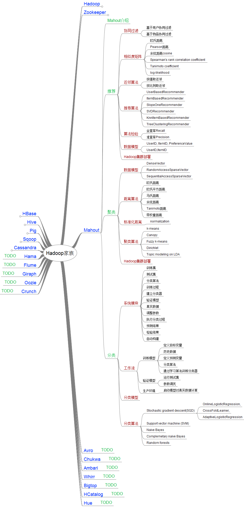
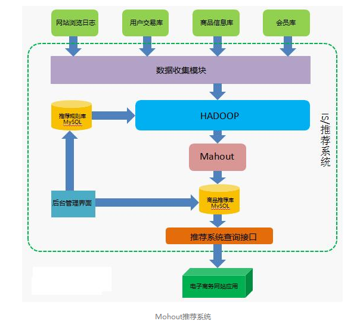
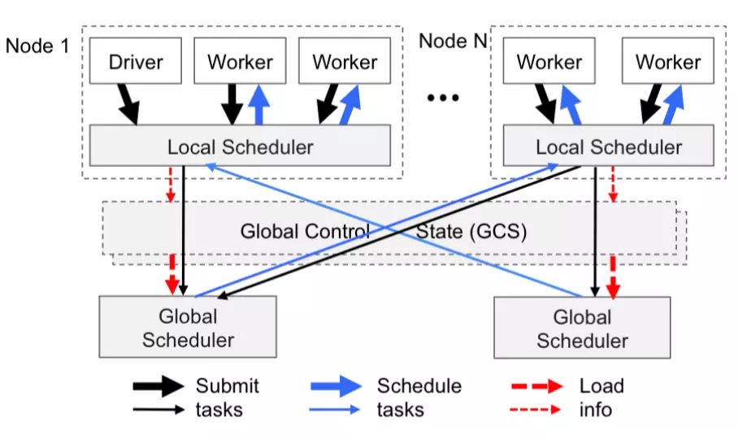
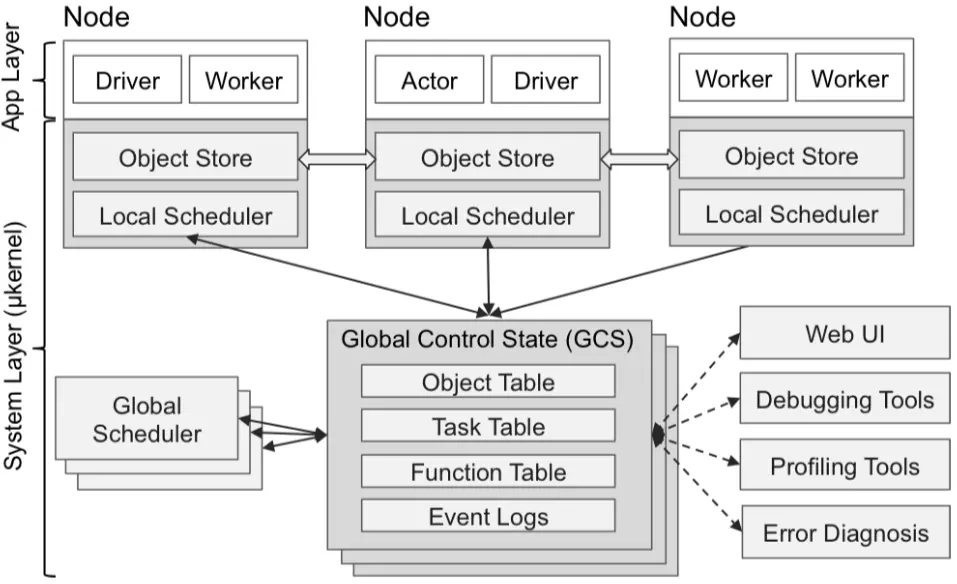
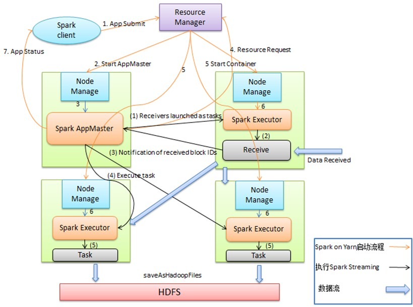
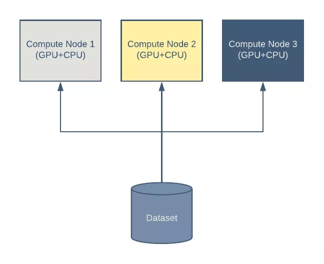
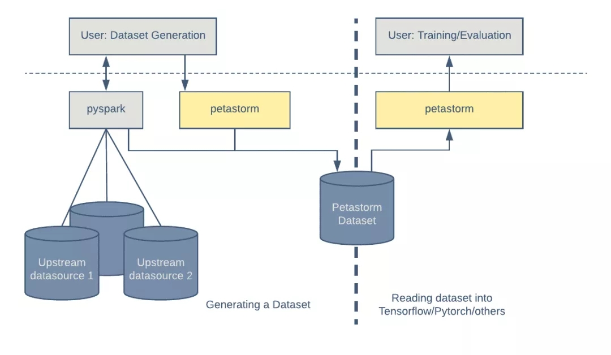
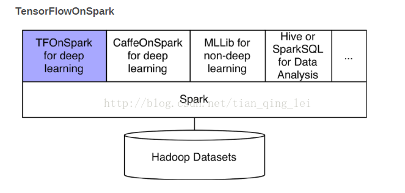
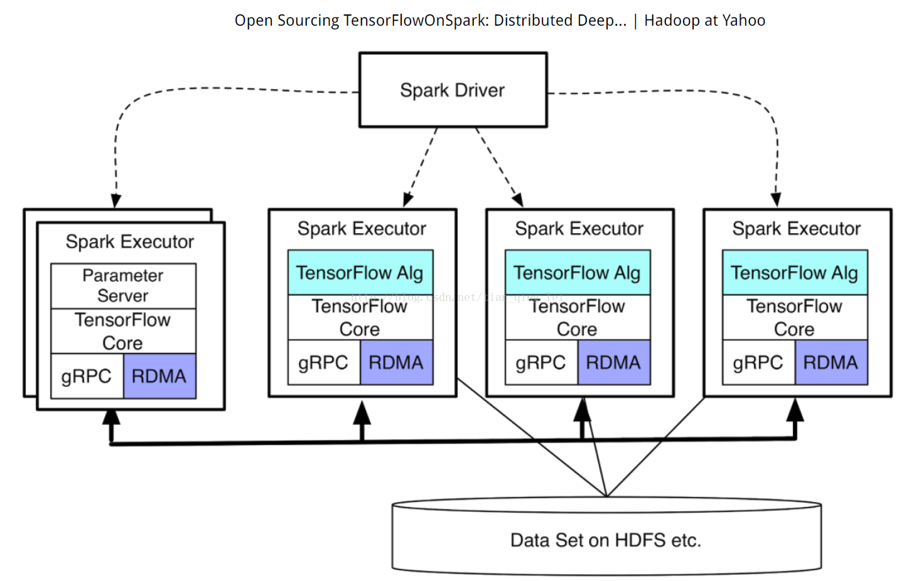

# 第十八章_后端架构选型、离线及实时计算

    Markdown Revision 1;
    Date: 2018/11/11
    Editor: 梁志成
    Contact: superzhicheng@foxmail.com

## 18.1 为什么需要分布式计算？

&emsp;&emsp;在这个数据爆炸的时代，产生的数据量不断地在攀升，从GB,TB,PB,ZB.挖掘其中数据的价值也是企业在不断地追求的终极目标。但是要想对海量的数据进行挖掘，首先要考虑的就是海量数据的存储问题，比如Tb量级的数据。

&emsp;&emsp;谈到数据的存储，则不得不说的是磁盘的数据读写速度问题。早在上个世纪90年代初期，普通硬盘的可以存储的容量大概是1G左右，硬盘的读取速度大概为4.4MB/s.读取一张硬盘大概需要5分钟时间，但是如今硬盘的容量都在1TB左右了,相比扩展了近千倍。但是硬盘的读取速度大概是100MB/s。读完一个硬盘所需要的时间大概是2.5个小时。所以如果是基于TB级别的数据进行分析的话，光硬盘读取完数据都要好几天了，更谈不上计算分析了。那么该如何处理大数据的存储，计算分析呢？

&emsp;&emsp;一个很简单的减少数据读写时间的方法就是同时从多个硬盘上读写数据，比如，如果我们有100个硬盘，每个硬盘存储1%的数据 ，并行读取，那么不到两分钟就可以完成之前需要2.5小时的数据读写任务了。这就是大数据中的分布式存储的模型。当然实现分布式存储还需要解决很多问题，比如硬件故障的问题，使用多台主机进行分布式存储时，若主机故障，会出现数据丢失的问题，所以有了副本机制：系统中保存数据的副本。一旦有系统发生故障，就可以使用另外的副本进行替换（著名的RAID冗余磁盘阵列就是按这个原理实现的）。其次比如一个很大的文件如何进行拆分存储，读取拆分以后的文件如何进行校验都是要考虑的问题。比如我们使用Hadoop中的HDFS也面临这个问题，只是框架给我们实现了这些问题的解决办法，开发中开发者不用考虑这些问题，底层框架已经实现了封装。

&emsp;&emsp;同样假如有一个10TB的文件，我们要统计其中某个关键字的出现次数，传统的做法是遍历整个文件，然后统计出关键字的出现次数，这样效率会特别特别低。基于分布式存储以后，数据被分布式存储在不同的服务器上，那么我们就可以使用分布式计算框架（比如MapReduce,Spark等）来进行并行计算（或者说是分布式计算），即：每个服务器上分别统计自己存储的数据中关键字出现的次数，最后进行一次汇总，那么假如数据分布在100台服务器上，即同时100台服务器同时进行关键字统计工作，效率一下子可以提高几十倍。

## 18.2 目前有哪些深度学习分布式计算框架？

### 18.2.1 PaddlePaddle

&emsp;&emsp;PaddlePaddle【1】是百度开源的一个深度学习平台。PaddlePaddle为深度学习研究人员提供了丰富的API，可以轻松地完成神经网络配置，模型训练等任务。 
官方文档中简易介绍了如何使用框架在
- 线性回归
- 识别数字
- 图像分类
- 词向量
- 个性化推荐
- 情感分析
- 语义角色标注
- 机器翻译

等方面的应用

&emsp;&emsp;Github地址：https://github.com/PaddlePaddle/Paddle

### 18.2.2 Deeplearning4j

&emsp;&emsp;DeepLearning4J（DL4J）【2】是一套基于Java语言的神经网络工具包，可以构建、定型和部署神经网络。DL4J与Hadoop和Spark集成，支持分布式CPU和GPU。

&emsp;&emsp;Deeplearning4j包括了分布式、多线程的深度学习框架，以及普通的单线程深度学习框架。定型过程以集群进行，也就是说，Deeplearning4j可以快速处理大量数据。Deeplearning4j在开放堆栈中作为模块组件的功能，使之成为为微服务架构打造的深度学习框架。

&emsp;&emsp;Deeplearning4j从各类浅层网络出发，设计深层神经网络。这一灵活性使用户可以根据所需，在分布式、生产级、能够在分布式CPU或GPU的基础上与Spark和Hadoop协同工作的框架内，整合受限玻尔兹曼机、其他自动编码器、卷积网络或递归网络。

&emsp;&emsp;Deeplearning4j在已建立的各个库及其在系统整体中的所处位置


&emsp;&emsp;Github地址：https://github.com/deeplearning4j/deeplearning4j

### 18.2.3 Mahout

&emsp;&emsp;Mahout【3】是基于Hadoop的机器学习和数据挖掘的一个分布式框架。Mahout用MapReduce实现了部分数据挖掘算法，解决了并行挖掘的问题。

&emsp;&emsp;Mahout包含许多实现，包括聚类、分类、推荐过滤、频繁子项挖掘等。

&emsp;&emsp;Mahout算法库：



&emsp;&emsp;Mahout应用场景：



&emsp;&emsp;Github地址：https://github.com/apache/mahout

### 18.2.4 Spark MLllib 

&emsp;&emsp;MLlib(Machine Learnig lib) 【4】是Spark对常用的机器学习算法的实现库，同时包括相关的测试和数据生成器。

&emsp;&emsp;MLlib是MLBase一部分，其中MLBase分为四部分：MLlib、MLI、ML Optimizer和MLRuntime。
- ML Optimizer会选择它认为最适合的已经在内部实现好了的机器学习算法和相关参数，来处理用户输入的数据，并返回模型或别的帮助分析的结果；
- MLI 是一个进行特征抽取和高级ML编程抽象的算法实现的API或平台；
- MLlib是Spark实现一些常见的机器学习算法和实用程序，包括分类、回归、聚类、协同过滤、降维以及底层优化，该算法可以进行可扩充； MLRuntime 基于Spark计算框架，将Spark的分布式计算应用到机器学习领域。

&emsp;&emsp;MLlib主要包含三个部分：
- 底层基础：包括Spark的运行库、矩阵库和向量库
- 算法库：包含广义线性模型、推荐系统、聚类、决策树和评估的算法
- 实用程序：包括测试数据的生成、外部数据的读入等功能


<center>架构图</center>


&emsp;&emsp;MLlib目前支持4种常见的机器学习问题: 分类、回归、聚类和协同过滤，MLlib在Spark整个生态系统中的位置如图下图所示。

### 18.2.5 Ray

&emsp;&emsp;Ray【5】是加州大学伯克利分校实时智能安全执行实验室(RISELab)的研究人员针对机器学习领域开发的一种新的分布式计算框架，该框架旨在让基于Python的机器学习和深度学习工作负载能够实时执行，并具有类似消息传递接口(MPI)的性能和细粒度。

&emsp;&emsp;增强学习的场景，按照原理定义，因为没有预先可用的静态标签信息，所以通常需要引入实际的目标系统（为了加快训练，往往是目标系统的模拟环境）来获取反馈信息，用做损失/收益判断，进而完成整个训练过程的闭环反馈。典型的步骤是通过观察特定目标系统的状态，收集反馈信息，判断收益，用这些信息来调整参数，训练模型，并根据新的训练结果产出可用于调整目标系统的行为Action，输出到目标系统，进而影响目标系统状态变化，完成闭环，如此反复迭代，最终目标是追求某种收益的最大化（比如对AlphoGo来说，收益是赢得一盘围棋的比赛）。

&emsp;&emsp;在这个过程中，一方面，模拟目标系统，收集状态和反馈信息，判断收益，训练参数，生成Action等等行为可能涉及大量的任务和计算（为了选择最佳Action，可能要并发模拟众多可能的行为）。而这些行为本身可能也是千差万别的异构的任务，任务执行的时间也可能长短不一，执行过程有些可能要求同步，也有些可能更适合异步。

&emsp;&emsp;另一方面，整个任务流程的DAG图也可能是动态变化的，系统往往可能需要根据前一个环节的结果，调整下一个环节的行为参数或者流程。这种调整，可能是目标系统的需要（比如在自动驾驶过程中遇到行人了，那么我们可能需要模拟计算刹车的距离来判断该采取的行动是刹车还是拐弯，而平时可能不需要这个环节），也可能是增强学习特定训练算法的需要（比如根据多个并行训练的模型的当前收益，调整模型超参数，替换模型等等）。

&emsp;&emsp;此外，由于所涉及到的目标系统可能是具体的，现实物理世界中的系统，所以对时效性也可能是有强要求的。举个例子，比如你想要实现的系统是用来控制机器人行走，或者是用来打视频游戏的。那么整个闭环反馈流程就需要在特定的时间限制内完成（比如毫秒级别）。

&emsp;&emsp;总结来说，就是增强学习的场景，对分布式计算框架的任务调度延迟，吞吐量和动态修改DAG图的能力都可能有很高的要求。按照官方的设计目标，Ray需要支持异构计算任务，动态计算链路，毫秒级别延迟和每秒调度百万级别任务的能力。

&emsp;&emsp;Ray的目标问题，主要是在类似增强学习这样的场景中所遇到的工程问题。那么增强学习的场景和普通的机器学习，深度学习的场景又有什么不同呢？简单来说，就是对整个处理链路流程的时效性和灵活性有更高的要求。

Ray框架优点
- 海量任务调度能力
- 毫秒级别的延迟
- 异构任务的支持
- 任务拓扑图动态修改的能力

&emsp;&emsp;Ray没有采用中心任务调度的方案，而是采用了类似层级（hierarchy）调度的方案，除了一个全局的中心调度服务节点（实际上这个中心调度节点也是可以水平拓展的），任务的调度也可以在具体的执行任务的工作节点上，由本地调度服务来管理和执行。
与传统的层级调度方案，至上而下分配调度任务的方式不同的是，Ray采用了至下而上的调度策略。也就是说，任务调度的发起，并不是先提交给全局的中心调度器统筹规划以后再分发给次级调度器的。而是由任务执行节点直接提交给本地的调度器，本地的调度器如果能满足该任务的调度需求就直接完成调度请求，在无法满足的情况下，才会提交给全局调度器，由全局调度器协调转发给有能力满足需求的另外一个节点上的本地调度器去调度执行。

&emsp;&emsp;架构设计一方面减少了跨节点的RPC开销，另一方面也能规避中心节点的瓶颈问题。当然缺点也不是没有，由于缺乏全局的任务视图，无法进行全局规划，因此任务的拓扑逻辑结构也就未必是最优的了。


<center>架构图</center>


<center>任务调度图</center>

&emsp;&emsp;Ray架构现状：
- API层以上 的部分还比较薄弱，Core模块核心逻辑估需要时间打磨。
- 国内目前除了蚂蚁金服和RISELab有针对性的合作以外，关注程度还很低，没有实际的应用实例看到，整体来说还处于比较早期的框架构建阶段。

&emsp;&emsp;Github地址：https://github.com/ray-project/ray

### 18.2.6 Spark stream

&emsp;&emsp;随着大数据的发展，人们对大数据的处理要求也越来越高，原有的批处理框架MapReduce适合离线计算，却无法满足实时性要求较高的业务，如实时推荐、用户行为分析等。 Spark Streaming是建立在Spark上的实时计算框架，通过它提供的丰富的API、基于内存的高速执行引擎，用户可以结合流式、批处理和交互试查询应用。

&emsp;&emsp;Spark是一个类似于MapReduce的分布式计算框架，其核心是弹性分布式数据集，提供了比MapReduce更丰富的模型，可以在快速在内存中对数据集进行多次迭代，以支持复杂的数据挖掘算法和图形计算算法。Spark Streaming【6】是一种构建在Spark上的实时计算框架，它扩展了Spark处理大规模流式数据的能力。

&emsp;&emsp;Spark Streaming的优势在于：
- 能运行在100+的结点上，并达到秒级延迟。
- 使用基于内存的Spark作为执行引擎，具有高效和容错的特性。
- 能集成Spark的批处理和交互查询。
- 为实现复杂的算法提供和批处理类似的简单接口。


<center>Spark Streaming架构图</center>

&emsp;&emsp;Spark Streaming把实时输入数据流以时间片Δt （如1秒）为单位切分成块。Spark Streaming会把每块数据作为一个RDD，并使用RDD操作处理每一小块数据。每个块都会生成一个Spark Job处理，最终结果也返回多块。


<center>Spark Streaming基本原理图</center>

&emsp;&emsp;正如Spark Streaming最初的目标一样，它通过丰富的API和基于内存的高速计算引擎让用户可以结合流式处理，批处理和交互查询等应用。因此Spark Streaming适合一些需要历史数据和实时数据结合分析的应用场合。当然，对于实时性要求不是特别高的应用也能完全胜任。另外通过RDD的数据重用机制可以得到更高效的容错处理。

### 18.2.7 Horovod

&emsp;&emsp;Horovod【7】 是 Uber 开源的又一个深度学习工具，它的发展吸取了 Facebook「一小时训练 ImageNet 论文」与百度 Ring Allreduce 的优点，可为用户实现分布式训练提供帮助。

&emsp;&emsp;Horovod 支持通过用于高性能并行计算的低层次接口 – 消息传递接口 (MPI) 进行分布式模型训练。有了 MPI，就可以利用分布式 Kubernetes 集群来训练 TensorFlow 和 PyTorch 模型。

&emsp;&emsp;分布式 TensorFlow 的参数服务器模型（parameter server paradigm）通常需要对大量样板代码进行认真的实现。但是 Horovod 仅需要几行。下面是一个分布式 TensorFlow 项目使用 Horovod 的示例：
```
import  tensorflow as tf
import horovod.tensorflow as hvd
# Initialize Horovod
hvd.init()
# Pin GPU to be used to process local rank (one GPU per process)
config = tf.ConfigProto()
config.gpu_options.visible_device_list = str(hvd.local_rank())
# Build model…
loss = …
opt = tf.train.AdagradOptimizer(0.01)
# Add Horovod Distributed Optimizer
opt = hvd.DistributedOptimizer(opt)
# Add hook to broadcast variables from rank 0 to all other processes during
# initialization.
hooks = [hvd.BroadcastGlobalVariablesHook(0)]
# Make training operation
train_op = opt.minimize(loss)
# The MonitoredTrainingSession takes care of session initialization,
# restoring from a checkpoint, saving to a checkpoint, and closing when done
# or an error occurs.
with tf.train.MonitoredTrainingSession(checkpoint_dir=“/tmp/train_logs”,
                                      config=config,
                                      hooks=hooks) as mon_sess:
 while not mon_sess.should_stop():
   # Perform synchronous training.
   mon_sess.run(train_op)
```

&emsp;&emsp;在该示例中，粗体文字指进行单个 GPU 分布式项目时必须做的改变：

- hvd.init() 初始化 Horovod。
- config.gpu_options.visible_device_list = str(hvd.local_rank()) 向每个 TensorFlow 流程分配一个 GPU。
- opt=hvd.DistributedOptimizer(opt) 使用 Horovod 优化器包裹每一个常规 TensorFlow 优化器，Horovod 优化器使用 ring-allreduce 平均梯度。
- hvd.BroadcastGlobalVariablesHook(0) 将变量从第一个流程向其他流程传播，以实现一致性初始化。如果该项目无法使用 MonitoredTrainingSession，则用户可以运行 hvd.broadcast_global_variables(0)。

&emsp;&emsp;之后，可以使用 mpirun 命令使该项目的多个拷贝在多个服务器中运行：

```
$ mpirun -np 16 -x LD_LIBRARY_PATH -H 
server1:4,server2:4,server3:4,server4:4 python train.py
```

&emsp;&emsp;mpirun 命令向四个节点分布 train.py，然后在每个节点的四个 GPU 上运行 train.py。

&emsp;&emsp;Github地址：https://github.com/uber/horovod

### 18.2.8 BigDL

&emsp;&emsp;BigDL【9】是一种基于Apache Spark的分布式深度学习框架。它可以无缝的直接运行在现有的Apache Spark和Hadoop集群之上。BigDL的设计吸取了Torch框架许多方面的知识，为深度学习提供了全面的支持；包括数值计算和高级神经网络；借助现有的Spark集群来运行深度学习计算，并简化存储在Hadoop中的大数据集的数据加载。

&emsp;&emsp;BigDL优点：
- 丰富的深度学习支持。模拟Torch之后，BigDL为深入学习提供全面支持，包括数字计算（通过Tensor）和高级神经网络 ; 此外，用户可以使用BigDL将预先训练好的Caffe或Torch模型加载到Spark程序中。
- 极高的性能。为了实现高性能，BigDL在每个Spark任务中使用英特尔MKL和多线程编程。因此，在单节点Xeon（即与主流GPU 相当）上，它比开箱即用开源Caffe，Torch或TensorFlow快了数量级。
- 有效地横向扩展。BigDL可以通过利用Apache Spark（快速分布式数据处理框架），以及高效实施同步SGD和全面减少Spark的通信，从而有效地扩展到“大数据规模”上的数据分析

&emsp;&emsp;BigDL缺点：
- 对机器要求高 jdk7上运行性能差 在CentOS 6和7上，要将最大用户进程增加到更大的值（例如514585）; 否则，可能会看到错误，如“无法创建新的本机线程”。 
- 训练和验证的数据会加载到内存，挤占内存

&emsp;&emsp;BigDL满足的应用场景：
- 直接在Hadoop/Spark框架下使用深度学习进行大数据分析（即将数据存储在HDFS、HBase、Hive等数据库上）；
- 在Spark程序中/工作流中加入深度学习功能；
- 利用现有的 Hadoop/Spark 集群来运行深度学习程序，然后将代码与其他的应用场景进行动态共享，例如ETL（Extract、Transform、Load，即通常所说的数据抽取）、数据仓库（data warehouse）、功能引擎、经典机器学习、图表分析等。

### 18.2.9 Petastorm

&emsp;&emsp;Petastorm是一个由 Uber ATG 开发的开源数据访问库。这个库可以直接基于数 TB Parquet 格式的数据集进行单机或分布式训练和深度学习模型评估。Petastorm 支持基于 Python 的机器学习框架，如 Tensorflow、Pytorch 和 PySpark，也可以直接用在 Python 代码中。


<center>深度学习集群</center>

&emsp;&emsp;即使是在现代硬件上训练深度模型也很耗时，而且在很多情况下，很有必要在多台机器上分配训练负载。典型的深度学习集群需要执行以下几个步骤：
- 一台或多台机器读取集中式或本地数据集。
- 每台机器计算损失函数的值，并根据模型参数计算梯度。在这一步通常会使用 GPU。
- 通过组合估计的梯度（通常由多台机器以分布式的方式计算得出）来更新模型系数。

&emsp;&emsp;通常，一个数据集是通过连接多个数据源的记录而生成的。这个由 Apache Spark 的 Python 接口 PySpark 生成的数据集稍后将被用在机器学习训练中。Petastorm 提供了一个简单的功能，使用 Petastorm 特定的元数据对标准的 Parquet 进行了扩展，从而让它可以与 Petastorm 兼容。
有了 Petastorm，消费数据就像在 HDFS 或文件系统中创建和迭代读取对象一样简单。Petastorm 使用 PyArrow 来读取 Parquet 文件。

&emsp;&emsp;将多个数据源组合到单个表格结构中，从而生成数据集。可以多次使用相同的数据集进行模型训练和评估。

<center>深度学习集群</center>

&emsp;&emsp;为分布式训练进行分片
在分布式训练环境中，每个进程通常负责训练数据的一个子集。一个进程的数据子集与其他进程的数据子集正交。Petastorm 支持将数据集的读时分片转换为正交的样本集。

<center>Petastorm 将数据集的非重叠子集提供给参与分布式训练的不同机器</center>

&emsp;&emsp;本地缓存
Petastorm 支持在本地存储中缓存数据。当网络连接速度较慢或带宽很昂贵时，这会派上用场。


Github地址：https://github.com/uber/petastorm

### 18.2.10 TensorFlowOnSpark

&emsp;&emsp;TensorFlowOnSpark【10】为 Apache Hadoop 和 Apache Spark 集群带来可扩展的深度学习。 通过结合深入学习框架 TensorFlow 和大数据框架 Apache Spark 、Apache Hadoop 的显着特征，TensorFlowOnSpark 能够在 GPU 和 CPU 服务器集群上实现分布式深度学习。

&emsp;&emsp;满足的应用场景：
为了利用TensorFlow在现有的Spark和Hadoop集群上进行深度学习。而不需要为深度学习设置单独的集群。


<center>架构图</center>


<center>运行流程图</center>

&emsp;&emsp;优点：
- 轻松迁移所有现有的TensorFlow程序，<10行代码更改; 
- 支持所有TensorFlow功能：同步/异步训练，模型/数据并行，推理和TensorBoard; 
- 服务器到服务器的直接通信在可用时实现更快的学习; 
- 允许数据集在HDFS和由Spark推动的其他来源或由TensorFlow拖动; 
- 轻松集成您现有的数据处理流水线和机器学习算法（例如，MLlib，CaffeOnSpark）; 
- 轻松部署在云或内部部署：CPU和GPU，以太网和Infiniband。
- TensorFlowOnSpark是基于google的TensorFlow的实现，而TensorFlow有着一套完善的教程，内容丰富。 

&emsp;&emsp;劣势：
- 开源时间不长，未得到充分的验证。

&emsp;&emsp;Github 地址： https://github.com/yahoo/TensorFlowOnSpark

## 18.3 如何选择合适的分布式计算框架进行模型训练？

## 18.4 如何进行实时计算？

## 18.5 如何进行离线计算？
   
## 18.6 如何使用分布式框架提高模型训练速度？

## 18.7 深度学习分布式计算框架如何在移动互联网中应用？

## 18.8 如何在个性化推荐中应用深度学习分布式框架？

## 18.9 如何评价个性化推荐系统的效果？

## 18.10 参考文献

【1】http://www.paddlepaddle.org/documentation/book/zh/0.11.0/05.recommender_system/index.cn.html

【2】https://deeplearning4j.org/cn/compare-dl4j-torch7-pylearn.html

【3】http://mahout.apache.org/

【4】http://spark.apache.org/docs/1.1.0/mllib-guide.html

【5】https://ray.readthedocs.io/en/latest/tutorial.html

【6】http://spark.apache.org/streaming/

【7】https://github.com/uber/horovod

【8】https://software.intel.com/en-us/articles/bigdl-distributed-deep-learning-on-apache-spark

【9】https://software.intel.com/en-us/articles/bigdl-distributed-deep-learning-on-apache-spark

【10】https://yahoo.github.io/TensorFlowOnSpark/#

 ....
 
 未完待续！

